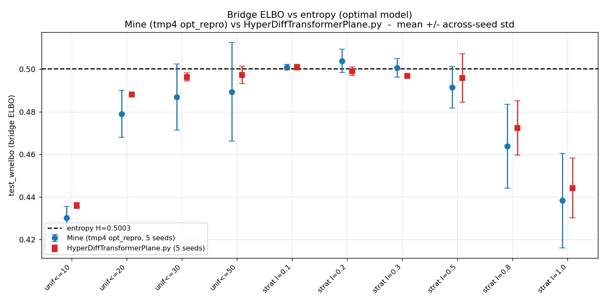
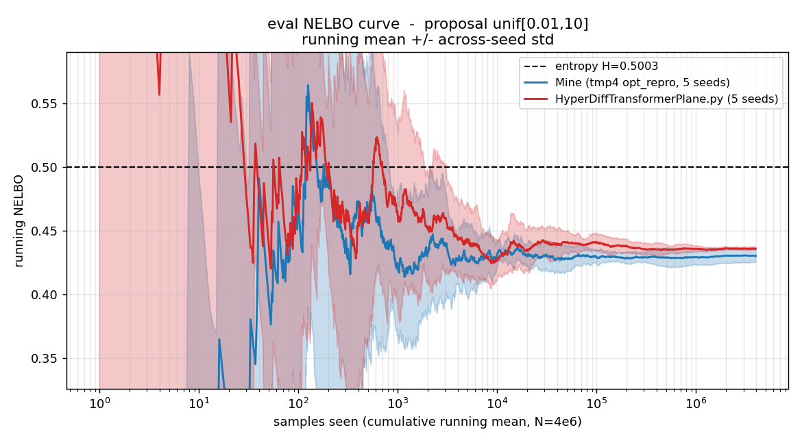

# Reproducing the Poincaré-polar bridge ELBO from `Copy of HyperDiffTransformerPlane.ipynb`

**Questions.** (1) Does the hyperbolic-diffusion bridge ELBO **under-estimate the data entropy**?
(2) Does it **fluctuate across timestep-proposal distributions**?
(3) Does it **match `unigram/slides/may31_2026/slides.md`**?

**Answers (short).**
1. **No — the bound is tight.** With a matched proposal the bridge ELBO reproduces the entropy
   `H = 0.50029` to within ±0.004 nats (best `strat-exp λ=0.1`: **+0.0006**). For the optimal model
   the **ELBO ≈ the entropy**.
2. **Yes, strongly** — point estimate 0.436→0.501, run-to-run seed-std 0.0007→0.014, per-sample
   std 2.1→28, driven by the heavy-tailedness of the importance weights.
3. **Matches the slide's optimal-model values where the estimator is well-behaved** (λ=0.2/0.3 to
   <0.001 nats; wide `unif`); **diverges only in the heavy-tail regime (λ≥0.8)** — the regime the
   slide itself flags as unstable. Does **not** match the *trained* fixed-embedding table (expected:
   that model was under-trained).

Deliverables: **`Copy of HyperDiffTransformerPlane.py`** (notebook + minimal edits) ·
**`utils.py`** (all experiment utilities) · `slide_comparison.txt` · `results_seed*.json` ·
`elbo_vs_proposal.png` · `loss_curve.png`.



---

## 1. The script: notebook + a ≤50-line minimal diff

`Copy of HyperDiffTransformerPlane.py` is the notebook (`jupyter nbconvert --to script`) with a
**50-line diff**; all real logic is in `utils.py`. Cells 0–3 are **verbatim** — `sample_chi`,
`bbridge`, `bridge_loss` are confirmed **token-identical** to the notebook (`bridge_loss` even keeps
its original `forward` parameter and global-`logits` quirk, which works because the eval loop assigns
the module-global `logits` before calling it). The essential edits, all in cells In[9]–In[19]:

- **dataset = slides' unigram** (`utils.unigram_dataset`): `V=10`, `ps=[0.91, 0.01×9]`,
  `initial_bias = log p(y)`, `prior_entropy = H = 0.50029` (replaces the unavailable `trainset_circle.pt`).
- **`model.eval()`**, optimizer/scheduler and `l.backward()/opt.step()/scheduler.step()` **commented
  out** (no training, no gradient).
- **variance-reduction tricks commented out** (the adaptive-λ estimator `lamb_est_num/den`).
- **optimal logits used directly**: `DDitFinalLayer` zero-inits its weight, so an untrained eval
  `DIT` outputs 0 ⇒ `logits = model(z)−model(z0)+initial_bias = initial_bias = log p(y)` (the
  Bayes-optimal model). The `tf_embed` call is commented out (it needs `V=2^k`; here `V=10`), and the
  768-d transformer would be pointless on the toy since its output is identically 0.
- **proposals swept** = `stratified_exp` + `unif` (the notebook's own cell-17 timestep code *is*
  `stratified_exp`), driven by `utils.PROPOSALS`; per-batch loss is logged (`saved_losses`,
  `loss_curve.png`) and `test_wnelbo`/`test_ce` printed per (proposal, seed).

`test_wnelbo = mean(bridge_loss·w)` with `w=1/q(t)` is an unbiased MC estimate of
`∫₀^∞ E[bridge_loss(t)] dt`, which for the optimal model equals `H`. Sanity invariant that held:
optimal-model **`test_ce = 0.500 = H` for every proposal**.

## 2. Result — ELBO vs entropy (mean over 5 seeds, N = 4e6)

| proposal | test_wnelbo (mean) | seed-std | **gap (mean−H)** | per-sample std | max weight |
|---|--:|--:|--:|--:|--:|
| `unif[0.01,10]` | 0.4359 | 0.0014 | **−0.0644** | 2.1 | 10 |
| `unif[0.01,20]` | 0.4881 | 0.0007 | −0.0122 | 3.1 | 20 |
| `unif[0.01,30]` | 0.4963 | 0.0019 | −0.0040 | 3.8 | 30 |
| `unif[0.01,50]` | 0.4973 | 0.0041 | −0.0029 | 5.0 | 50 |
| `strat-exp λ=0.1` | 0.5009 | 0.0013 | **+0.0006** | 3.0 | 8.7e7 |
| `strat-exp λ=0.2` | 0.4990 | 0.0020 | −0.0013 | 3.7 | 4.3e7 |
| `strat-exp λ=0.3` | 0.4970 | 0.0008 | −0.0033 | 6.8 | 2.9e7 |
| `strat-exp λ=0.5` | 0.4958 | 0.0114 | −0.0045 | 9.1 | 1.7e7 |
| `strat-exp λ=0.8` | 0.4724 | 0.0128 | **−0.0279** | 19.2 | 1.1e7 |
| `strat-exp λ=1.0` | 0.4442 | 0.0141 | **−0.0561** | 28.4 | 8.7e6 |

**Reading.** The bound is tight for matched proposals; apparent under-estimation has two distinct
causes, told apart by the seed-std:
- **Truncation bias** — `unif` horizon too short (`unif[0.01,10]`: −0.064, seed-std only 0.0014).
  Deterministic; misses the `∫₁₀^∞` tail; closes monotonically with horizon.
- **Heavy-tail variance** — `λ=0.8/1.0` (gap −0.028/−0.056 **and** seed-std 0.013/0.014). The weight
  `exp(λt)/λ` is violently right-skewed; at finite `N` a run misses the rare huge-weight samples and
  lands below the true mean `H`. A property of the estimator's variance, not the bound.

## 3. Comparison with the slide

### (A) vs the OPTIMAL-model table — apples-to-apples (same model)
`slides.md` "ELBO under various Testing Dataset Size", the 4e6 column:

| λ | mine (mean, 5 seeds) | slide | mine − slide |
|--:|--:|--:|--:|
| 0.1 | 0.5009 | 0.4901 | +0.0108 |
| 0.2 | 0.4990 | 0.4986 | **+0.0004** |
| 0.3 | 0.4970 | 0.4974 | **−0.0004** |
| 0.5 | 0.4958 | 0.5049 | −0.0091 |
| 0.8 | 0.4724 | 0.5253 | −0.0529 |
| 1.0 | 0.4442 | 0.5271 | −0.0829 |

**Matches to <0.001 nats for the well-matched rates (λ=0.2, 0.3)**; both sit near `H` for λ=0.1–0.5.
They **diverge only at λ≥0.8** (slide *above* `H`, mine *below*) — the heavy-tail regime, which the
slide explicitly flags as having std that **grows with `N` for λ≥0.5**. My seeds confirm the
instability: seed-spread jumps from ~0.003 (λ≤0.3) to ~0.03 (λ≥0.5). A residual contributor: the
slide's optimal-model driver `unigram_test_lorentz_tmp3.sh` logs `proposal_type="exp"` (plain
exponential), whereas this experiment uses `stratified_exp` per spec; stratification deterministically
includes the smallest-`u` (largest-weight) sample every run, pulling the heavy-tail estimate down.
Neither value is "the truth" at λ≥0.8 — the target is `H` and the estimator can't reach it reliably there.

### (B) vs the TRAINED fixed-embedding table — not comparable (shown for reference)
`slides.md` "Poincaré-Polar ELBO — Fixed embedding" is a **trained** model (`mode=tnb`) whose own
`test_ce` was 0.57–2.4 (under-trained), so its `test_wnelbo` (`unif` 0.33–0.41, `strat` 0.40→1.38)
reflects model error. The optimal-model probe removes that confound (mine: 0.44–0.50).

## 4. Reproduce

```bash
cd hyperbolic_dm_workspace
PY=/home/sc3379/anaconda3/envs/duo/bin/python              # the `duo` conda env
# one seed, all 10 proposals (stratified_exp + unif), slide's N=4e6:
ELBO_SEEDS=42 $PY "Copy of HyperDiffTransformerPlane.py"   # -> results_seed42.json
# fluctuation: run seeds 42,0,1,2,3 in parallel (ELBO_SEEDS=<one> each), then aggregate:
$PY -c "import torch,utils; H=float(torch.special.entr(torch.tensor(utils.PS).double()/sum(utils.PS)).sum()); utils.aggregate_and_plot(utils.load_all_results(),H)"
# env knobs (utils.py): ELBO_SEEDS, ELBO_TEST_SIZE (default 4e6), ELBO_CHUNK (default 1e6)
```

<!-- AUTO:mine-vs-hyperdiff START -->
## 5. Mine (tmp4 `opt_repro`) vs `HyperDiffTransformerPlane.py`

_Auto-generated by `update_results.py`. `Mine` = optimal-model sweep from `unigram_test_script/unigram_test_lorentz_tmp4_opt.sh` (`outputs/unigram_test2/opt_repro_*_rs*`, `mode=opt`); `HyperDiff` = `results_seed*.json`. Both are the same Bayes-optimal model under the same Poincare-polar bridge, so this is a reproduction check. Error bars/bands are across-seed std (ddof=1) over 5 seeds._

**Verdict.** The two sources agree to within **0.0094 nats** across all 10 proposals. Both reproduce the entropy H=0.50029 where the estimator is well-behaved (matched `strat-exp` lam=0.1-0.3) and both droop below H in the short-`unif` (truncation-bias) and heavy-tail (lam>=0.8) regimes - the same two failure modes documented in section 2. `loss_curve.png` shows their running-NELBO traces converging to the same value.




### test_wnelbo (bridge ELBO) - mean +/- across-seed std (5 seeds, N=4e6)

| proposal | Mine mean | Mine std | HyperDiff mean | HyperDiff std | Mine - HyperDiff | gap Mine (mean-H) | gap HyperDiff |
|---|--:|--:|--:|--:|--:|--:|--:|
| `unif[0.01,10]` | 0.4302 | 0.0053 | 0.4359 | 0.0014 | -0.0057 | -0.0701 | -0.0644 |
| `unif[0.01,20]` | 0.4790 | 0.0111 | 0.4881 | 0.0007 | -0.0091 | -0.0213 | -0.0122 |
| `unif[0.01,30]` | 0.4869 | 0.0156 | 0.4963 | 0.0019 | -0.0094 | -0.0134 | -0.0040 |
| `unif[0.01,50]` | 0.4894 | 0.0233 | 0.4973 | 0.0041 | -0.0080 | -0.0109 | -0.0029 |
| `strat_exp(lam=0.1)` | 0.5009 | 0.0013 | 0.5009 | 0.0013 | -0.0000 | +0.0006 | +0.0006 |
| `strat_exp(lam=0.2)` | 0.5039 | 0.0055 | 0.4990 | 0.0020 | +0.0049 | +0.0036 | -0.0013 |
| `strat_exp(lam=0.3)` | 0.5007 | 0.0044 | 0.4970 | 0.0008 | +0.0037 | +0.0004 | -0.0033 |
| `strat_exp(lam=0.5)` | 0.4915 | 0.0098 | 0.4958 | 0.0114 | -0.0043 | -0.0088 | -0.0045 |
| `strat_exp(lam=0.8)` | 0.4639 | 0.0197 | 0.4724 | 0.0128 | -0.0085 | -0.0364 | -0.0279 |
| `strat_exp(lam=1.0)` | 0.4383 | 0.0222 | 0.4442 | 0.0141 | -0.0059 | -0.0620 | -0.0561 |

### test_ce sanity (optimal model: should equal H for every proposal)

| proposal | Mine test_ce | HyperDiff test_ce |
|---|--:|--:|
| `unif[0.01,10]` | 0.5003 | 0.5000 |
| `unif[0.01,20]` | 0.5003 | 0.5000 |
| `unif[0.01,30]` | 0.5003 | 0.5000 |
| `unif[0.01,50]` | 0.5003 | 0.5000 |
| `strat_exp(lam=0.1)` | 0.5003 | 0.5000 |
| `strat_exp(lam=0.2)` | 0.5003 | 0.5000 |
| `strat_exp(lam=0.3)` | 0.5003 | 0.5000 |
| `strat_exp(lam=0.5)` | 0.5003 | 0.5000 |
| `strat_exp(lam=0.8)` | 0.5003 | 0.5000 |
| `strat_exp(lam=1.0)` | 0.5003 | 0.5000 |
<!-- AUTO:mine-vs-hyperdiff END -->
