

# Hyperbolic DLM

### May 22, 2026

---

## Poincare Disk - Cartesian Bridge ELBO Loss

$$
\begin{aligned}
\mathcal{L}(\theta; y)
& =
\frac{(d-1)^2}{2}
\sum_{i=1}^{N}
w(t_i) \mathbb{E}_{z_{t_i} \sim q_{t_i \mid \infty}(\cdot \mid y)}
\left[
	\int_0^\infty
	(1 - \|z_t\|^2)^2
	\left\|
	\frac{y - z_t}{\|y - z_t\|^2}
	-
	\mathbb{E}_{v \sim \mu^\theta(\cdot \mid z_t)} \left[
	\frac{v - z_t}{\|v - z_t\|^2} \right]
	\right\|^2
	dt
\right] \\
\mu^{\theta}(z_t) 
& = \operatorname{softmax} \big( f_{\theta}(z_t) + (d-1) \sum_{v \in V} e_v \log \frac{1 - || v ||^2 }{|| z_t - v ||^2} \big)
\end{aligned}
$$
where $w(t_i)$ is the importance sampling weight of the timestep $t_i$, $y$ is the boundary points, $z_t$ is the bridge at timestep $t$.

---

## Lorentz - Cartesian Bridge ELBO Loss

### Brownian Motion on Lorentz Model

Consider the Brownian bridge on the local chart of Lorentz model,
$$
\begin{aligned}
dx_t
=
\left(
- \frac{(d-1)}{\langle x_t, \xi(y)\rangle_L}\xi(y)
- \frac{d-2}{2} x_t
\right)dt
+ \Pi_{x_t}\, dW_t.
\end{aligned}
$$

where  $<\cdot, \cdot>_{L}$ is Lorentz inner product and $\xi(y)$ is $[1, y_1, y_2, \dots, y_d]$ and $\Pi_x = I_{d+1}+x x^\top J$ with $J = \operatorname{diag}(-1,1,\dots,1)$

---

## Lorentz - Cartesian Bridge ELBO Loss

Instead of matching the drift directly, we choose $\mu^{\theta}$ re-parametrization, the loss function can be written as
$$
\begin{aligned}
\mathcal{L}(\theta; y)
& =
\frac{(d-1)^2}{2}
\mathbb{E}_{z_{t} \sim q_{t \mid \infty}(\cdot \mid y)}
\left[
	\int_0^\infty
	\left\|
	\frac{\xi(y)}{\langle z_t, \xi(y) \rangle_{L}}
	-
	\mathbb{E}_{v \sim \mu^\theta(\cdot \mid z_t)} \left[
	\frac{\xi(v)}{\langle z_t, \xi(v) \rangle_{L}} \right]
	\right\|_L^2
	dt
\right] \\
\mu^{\theta}(z_t) 
& = \operatorname{softmax} \big( f_{\theta}(z_t) + (d-1) \sum_{v \in V} e_v \log \frac{- \langle z, x \rangle_{L}}{- \langle O, x \rangle_{L}} \big)
\end{aligned}
$$
where $\| x \|_{L}^2 := \langle x, x \rangle_L$ is the Lorentz norm.

---

## Lorentz - Cartesian Bridge ELBO Loss

If we further consider the importance sampling from a proposal distribution $t_i \sim \pi$, the loss can be represented as
$$
\begin{aligned}
\mathcal{L}(\theta; y)
& =
\frac{(d-1)^2}{2}
\sum_{i=1}^{N} w(t_i)
\mathbb{E}_{z_{t_i} \sim q_{t_i \mid \infty}(\cdot \mid y)}
\left[
	\int_0^\infty
	\left\|
	\frac{\xi(y)}{\langle z_{t_i}, \xi(y) \rangle_{L}}
	-
	\mathbb{E}_{v \sim \mu^\theta(\cdot \mid z_{t_i})} \left[
	\frac{\xi(v)}{\langle z_{t_i}, \xi(v) \rangle_{L}} \right]
	\right\|_L^2
	dt
\right] \\
\end{aligned}
$$
where $w(t_i)$ is the importance sampling weight of the timestep $t_i$, $y$ is the boundary points, $z_t$ is the bridge at timestep $t$.

---

## Exponential Proposal Distribution

**Density $p(t)$ and CDF $F(t)$ on $[0, \infty)$:**
$$
p(t) = \lambda e^{-\lambda t}, 
\qquad 
F(t) = 1 - e^{-\lambda t}
$$

**Inverse-CDF sampling.** Set $F(t) = u$ with $u \sim \mathrm{Uniform}(0,1)$:
$$
t = -\frac{\ln(1-u)}{\lambda}
$$

---

# Trained Model: Cross-Entropy vs Poincaré Loss

### Which training loss learns the bridge?

---

## Training Model Setting Up

**which loss should we train with? CE or ELBO**

- Vocab size: 10  |  Data dist: $[0.91,\ 0.01\times 9]$  |  entropy $\approx 0.500$
- Proposal: 
  - **stratified exponential**, rate $\lambda \in \{0.01, 0.1, 0.2, 0.3, 0.5, 0.8, 1.0, 2.0\}$
  - **uniform** $[0.01, 10]$
- Bridge horizon: `hyper_T` $= 1000$, `hyper_dt` $= 0.01$

---

## Training Model Setting Up

- Test set: **4,000,000** samples per run
- **Two training losses** compared head-to-head:
  - <r>`cross_entropy`</r> — plain CE on the denoiser logits
  - <b>`poincare_polar`</b> — geometry-aware bridge ELBO

---

## Two Metrics, Two Roles

| Metric | What it measures | Estimator |
|---|---|---|
| `test_ce` | plain cross-entropy of the denoiser logits | model's **own** loss proposal |
| `test_wnelbo` | importance-weighted **Poincaré** bridge ELBO | **fixed**: `poincare_polar`, stratified-exp $\lambda{=}0.1$ |

---

## Compare Cross Entropy and ELBO Losses

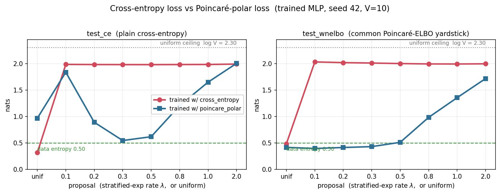

- Exp Proposal: <b>Poincaré</b> beats <r>CE</r>
- Unif Proposal: <b>Poincaré</b> similar <r>CE</r>

---

## IS-NELBO Results (`test_wnelbo`)

| proposal | <r>CE-trained</r> | <b>PP-trained</b> | CE / PP |
|:--:|:--:|:--:|:--:|
| uniform | 0.481 | **0.416** | 1.2× |
| 0.01 | <r>NaN</r> | <r>NaN</r> | — |
| **0.1** | <r>2.031</r> | **0.396** | **5.1×** |
| 0.2 | <r>2.017</r> | 0.414 | 4.9× |
| 0.3 | <r>2.009</r> | 0.430 | 4.7× |
| 0.5 | <r>1.999</r> | 0.512 | 3.9× |
| 0.8 | <r>1.992</r> | 0.983 | 2.0× |
| 1.0 | <r>1.991</r> | 1.355 | 1.5× |
| 2.0 | <r>1.995</r> | 1.716 | 1.2× |

---

## Cross-Entropy Results (`test_ce`)

| proposal | <r>CE-trained</r> | <b>PP-trained</b> | winner |
|:--:|:--:|:--:|:--:|
| uniform | **0.316** | 0.966 | <r>CE</r> |
| 0.01 | <r>NaN</r> | <r>NaN</r> | — |
| 0.1 | 1.984 | 1.835 | PP |
| 0.2 | 1.981 | 0.891 | PP |
| 0.3 | 1.979 | **0.545** | <b>PP</b> |
| 0.5 | 1.979 | 0.618 | <b>PP</b> |
| 0.8 | 1.981 | 1.206 | PP |
| 1.0 | 1.982 | 1.648 | PP |
| 2.0 | 1.990 | 2.003 | tie |

**Surprise:** the ELBO loss yields *lower cross-entropy* than the CE loss at every stratified $\lambda$ (e.g. $\lambda{=}0.3$: **0.545 vs 1.979**). CE wins **only** under the uniform proposal (0.316, below the 0.50 floor).

---

## Why Cross-Entropy Loss Fails Under Importance Sampling

The proposal weight (=  1 / propsal density) grows exponentially as time goes up, causing cross entropy loss blow-up, while the Poinare ELBO loss will be re-scaled by $(1 - \|z_t\|^2)^2$

- Exp(0.1)

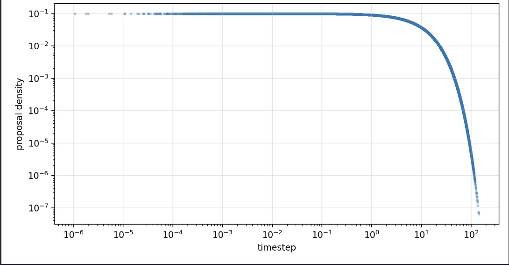

---

## Why Cross-Entropy Loss Fails Under Importance Sampling

- Exp(0.5)

- Exp(1.0)

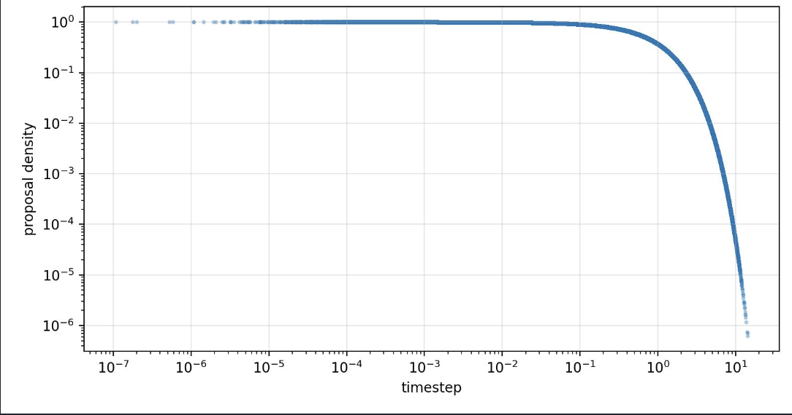

---

# Stratified-Exp Proposal — Seed-Variance Study

---

## Stratified-Exp Proposal — Seed-Variance Study

How does the proposal rate $\lambda$ affect the **stability** and **variance**
of the test NELBO estimator?

*21-seed sweep, optimal model, 4M test samples*

---

## Experiment Set Up

### Stratified Exponential Proposal — 21-Seed Sweep

- Model: **optimal model** — emits the ground-truth unigram distribution (no training)
- Vocab size: 10  |  Data dist: $[0.91,\ 0.01\times 9]$  |  entropy $\approx 0.500$
- Proposal: **stratified exponential**, rate $\lambda \in \{0.01, 0.1, 0.2, 0.3, 0.5, 0.8, 1.0, 2.0\}$
- Bridge horizon: `hyper_T` $= 1000$, `hyper_dt` $= 0.01$
- Test set: **4,000,000** samples per run
- Repeats: **21 random seeds** per $\lambda$
- Geometries: **Lorentz–Cartesian**, **Poincaré–Polar**

---

## What "Good" Looks Like

For an **optimal model**, the test NELBO should equal the data entropy.

| Reference | Value |
|---|:--:|
| Cross-entropy (data entropy) | **0.5003** |
| ⇒ ideal `test_loss` | **≈ 0.500** |

- `test_loss` = IS-NELBO
- `test_loss_var` = variance of IS-NELBO (IS-NELBO Var)

---

## Poincaré–Polar — Test NELBO vs $\lambda$

| $\lambda$ | valid | IS-NELBO (mean ± std) | IS-NELBO Var |
|:--:|:--:|:--:|:--:|
| 0.01 | 0 / 21 | <r>NaN</r> | <r>NaN</r> |
| 0.1  | 21 / 21 | **0.5001 ± 0.0011** | 9 |
| 0.2  | 21 / 21 | 0.4998 ± 0.0024 | 23 |
| 0.3  | 21 / 21 | 0.4983 ± 0.0032 | 63 |
| 0.5  | 21 / 21 | 0.4992 ± 0.0123 | 648 |
| 0.8  | 21 / 21 | 0.4840 ± 0.0236 | 1,849 |
| 1.0  | 21 / 21 | 0.4805 ± 0.0460 | 9,111 |
| 2.0  | 21 / 21 | <r>0.3864</r> ± 0.0416 | 5,259 |

---

## Poincaré–Polar — Test NELBO vs $\lambda$

- Small $\lambda$ (0.1–0.3) is **unbiased**; large $\lambda$ drifts **below** the 0.500 target.

- IS-NELBO Var rises from **9** ($\lambda{=}0.1$) to **9,100** ($\lambda{=}1.0$)

---

## Lorentz–Cartesian — Test NELBO vs $\lambda$

Lorentz is **far more fragile**: every $\lambda \le 0.5$ collapses to NaN.

| $\lambda$ | valid | IS-NELBO (mean ± std) | IS-NELBO Var |
|:--:|:--:|:--:|:--:|
| <0.5 | 0 / 21 | <r>NaN</r> | <r>NaN</r> |
| 0.8  | 16 / 21 | 0.4812 ± 0.0228 | 1,808 |
| 1.0  | 20 / 21 | 0.4809 ± 0.0471 | 9,527 |
| 2.0  | 21 / 21 | <r>0.3864</r> ± 0.0416 | 5,259 |

---

## Three Regimes of the Proposal Rate $\lambda$

| Regime | $\lambda$ (Polar) | Behaviour |
|---|:--:|---|
| **Too small** | $\le 0.01$ | <r>NaN</r> — heavy-tailed weights $1/(\lambda u)$ blow up |
| **Stable** | **0.1 – 0.3** | <b>unbiased</b> (mean ≈ 0.500), variance 9 – 63 |
| **Too large** | $\ge 0.8$ | variance $10^3$–$10^4$; <r>biased low</r> (0.39 at $\lambda{=}2$) |

---

## Conclusion

- **Sweet spot: $\lambda \approx 0.1$** (Poincaré–Polar) — recovers the target (0.5001 vs 0.500) with the smallest seed std (0.001) and lowest estimator variance (9).
- **Variance grows monotonically with $\lambda$**, numerically unstable
- **Large $\lambda$ ($\ge 2$) is biased low** (0.386 < 0.500) — consistent with tail-truncation, not a tighter bound.

---

## Stratified-Exp Proposal — NELBO, IS+NELBO, and Proposal Weight Visualization

---

## Motivation

Open up the test loss — **per-sample** views vs timestep $t$:

- **NELBO** $\ell(t)$ — the un-weighted loss integrand (geometry behaviour)
- **Weighted  NELBO** $\ell(t)\,w(t)$ — what the test-loss estimator actually averages, weighted by IS
- **Proposal density** $p(t)=  \lambda e^{-\lambda t}$ — *where* samples land along $t$

Goal: explain **why** small $\lambda$ NaNs (Lorentz) and large $\lambda$ blows up the variance.

---

## Experiment Set Up

- Driver: `unigram/unigram_test2_tmp3.py`, **seed = 42**
- Model: **optimal** (`mode=opt`) — emits ground-truth unigram dist, no training
- Vocab size: 10  |  Data dist: $[0.91,\ 0.01\times 9]$  |  entropy ≈ **0.5003**
- Bridge horizon: `hyper_T = 1000`, `hyper_dt = 0.01`, `rotate_emb = True`
- Test set: **4,000,000** samples per run
- Proposal: **stratified exponential**, $\lambda \in \{0.01, 0.1, 0.2, 0.3, 0.5, 0.8, 1.0, 2.0\}$
- Geometries: **Lorentz–Cartesian** and **Poincaré–Polar** 
---

## What Each Plot Shows

Per-sample log–log scatter of 4M samples (one figure per run, three stacked panels):

1. **Weighted NELBO** $\ell(t)\,w(t)$ — `W-NELBO`
2. **NELBO (unweighted)** $\ell(t)$ — pure bridge term = `UW-NELNO`
3. **proposal density** $p(t) = \lambda e^{-\lambda t}$ exponential distribution

The Idea **Weighted NELBO** = **0.5003** (data entropy)

Generated by `plot_test_loss_vs_timestep` in `unigram/unigram_test2_tmp3.py:615`.

---

## Poincaré–Polar — Summary (seed 42)

| $\lambda$ | `W-NELBO` | `UW-NELNO` | `W-NELBO Var` |
|:--:|:--:|:--:|:--:|
| 0.01 | <r>NaN</r> | <r>NaN</r> | <r>NaN</r> |
| 0.1  | **0.4995** | 0.0338 | **9.3** |
| 0.2  | 0.5020 | 0.0513 | 17.6 |
| 0.3  | 0.4997 | 0.0619 | 57.6 |
| 0.5  | 0.5045 | 0.0738 | 524 |
| 0.8  | 0.4936 | 0.0824 | 1,248 |
| 1.0  | 0.4914 | 0.0854 | 4,349 |
| 2.0  | <r>0.3539</r> | 0.0914 | 1,349 |

---

## Lorentz–Cartesian — Summary (seed 42)

| $\lambda$ | `W-NELBO` | `UW-NELNO` | `W-NELBO Var` |
|:--:|:--:|:--:|:--:|
| 0.01 | <r>NaN</r> | <r>NaN</r> | <r>NaN</r> |
| 0.1  | <r>NaN</r> | <r>NaN</r> | <r>NaN</r> |
| 0.2  | <r>NaN</r> | <r>NaN</r> | <r>NaN</r> |
| 0.3  | <r>NaN</r> | <r>NaN</r> | <r>NaN</r> |
| 0.5  | <r>NaN</r> | <r>NaN</r> | <r>NaN</r> |
| 0.8  | 0.4936 | 0.0824 | 1,248 |
| 1.0  | 0.4914 | 0.0854 | 4,349 |
| 2.0  | <r>0.3539</r> | 0.0914 | 1,349 |

---

## Per-Sample Scatter — Sweeping $\lambda$ across both geometries

For each $\lambda$ we show the **same three panels** side-by-side:

- **Left**: Poincaré–Polar  ·  **Right**: Lorentz–Cartesian
- Panels (top → bottom): **weighted NELBO**, **NELBO (unweighted)**, **proposal density**
- 4M samples per run, log–log axes

The story across $\lambda$: NaN regime → stable regime → variance blow-up → biased-low regime.

---

## $\lambda = 0.01$ — both geometries NaN

**Poincaré: <r>NaN</r>**  ·  **Lorentz: <r>NaN</r>**

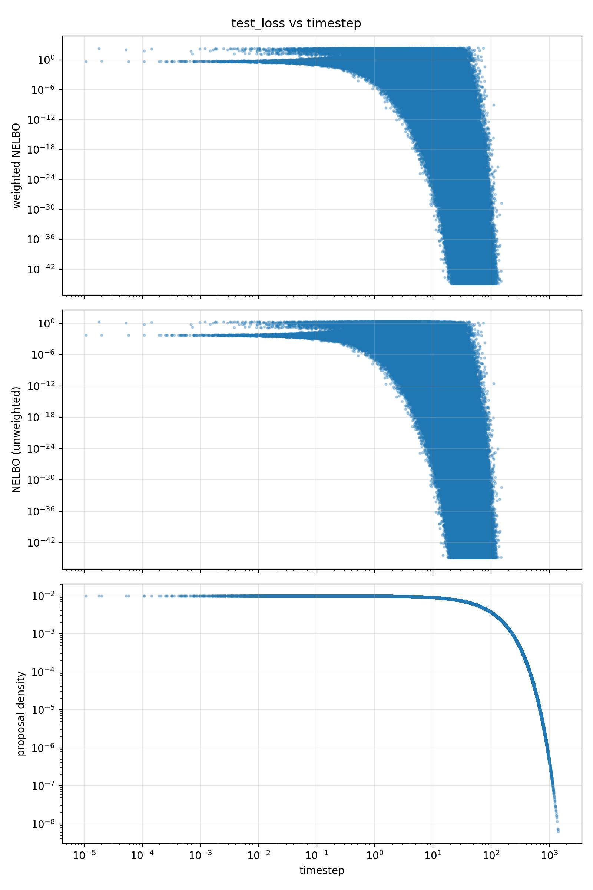 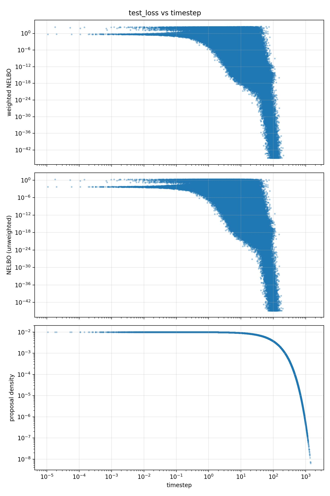

---

## $\lambda = 0.1$ — Poincaré sweet spot, Lorentz still NaN

**Poincaré: 0.4995, var 9.3**  ·  **Lorentz: <r>NaN</r>**

 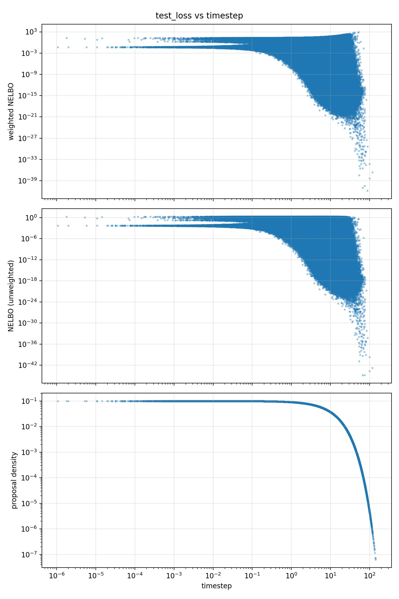

---

## $\lambda = 0.2$ — Poincaré stable, Lorentz NaN

**Poincaré: 0.5020, var 17.6**  ·  **Lorentz: <r>NaN</r>**

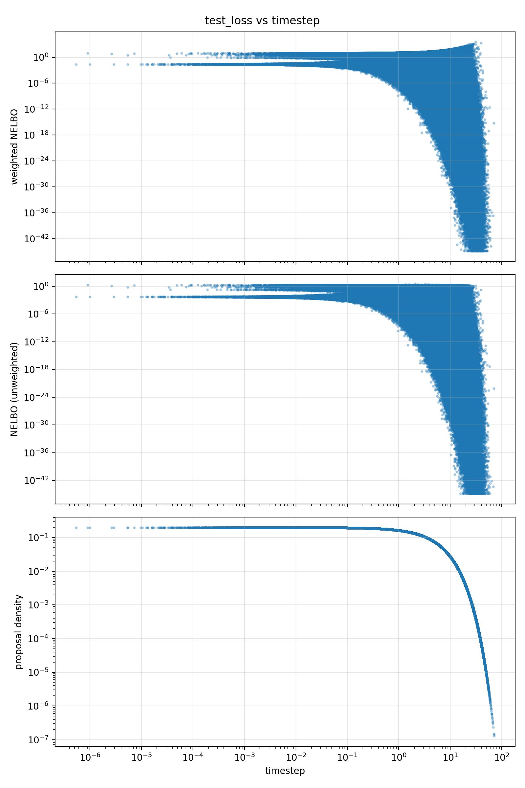 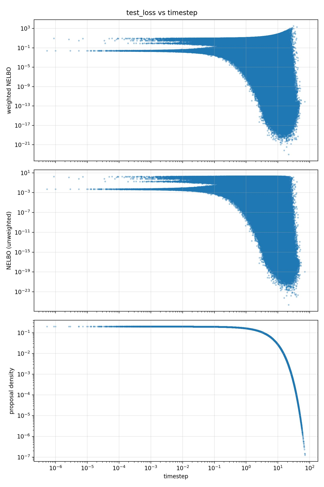

---

## $\lambda = 0.3$ — Poincaré stable, Lorentz NaN

**Poincaré: 0.4997, var 57.6**  ·  **Lorentz: <r>NaN</r>**

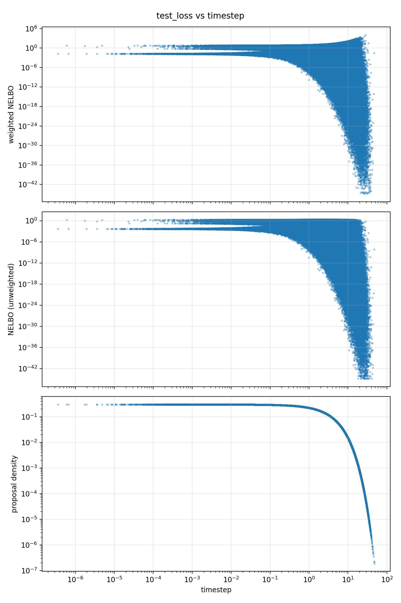 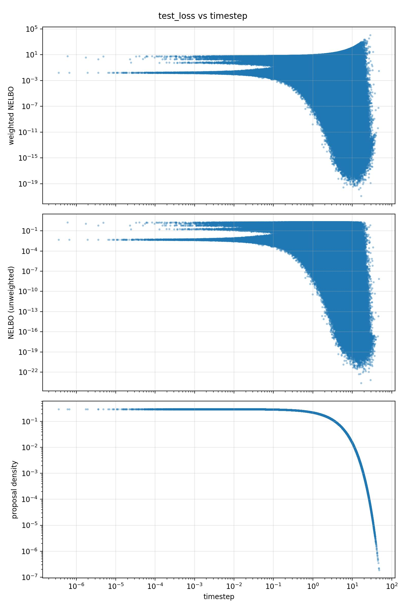

---

## $\lambda = 0.5$ — Poincaré on-target but high variance, Lorentz NaN

**Poincaré: 0.5045, var 524**  ·  **Lorentz: <r>NaN</r>**

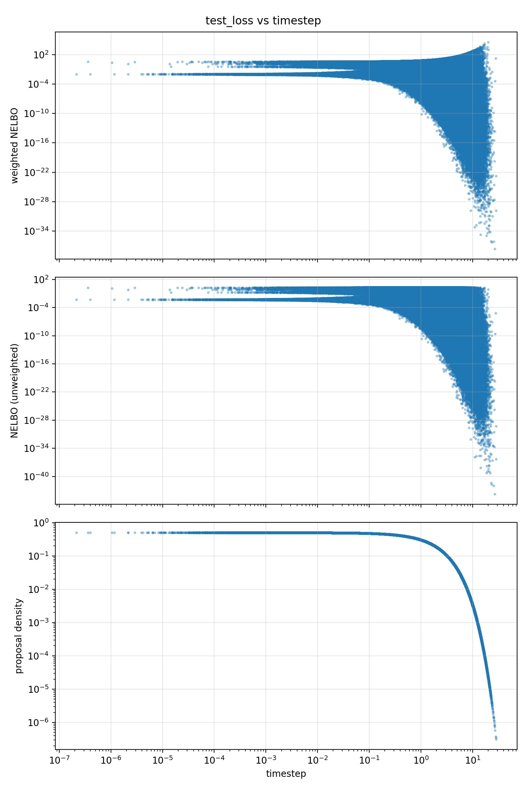 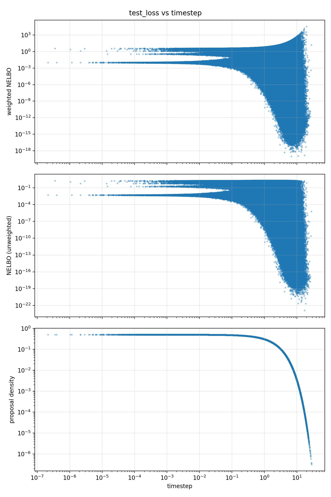

---

## $\lambda = 0.8$ — both stable, geometries **agree exactly**

**Poincaré: 0.4936, var 1,248**  ·  **Lorentz: 0.4936, var 1,248**

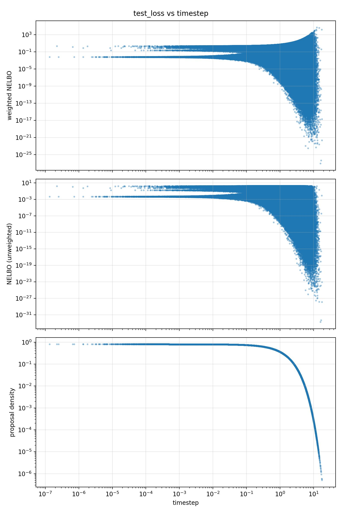 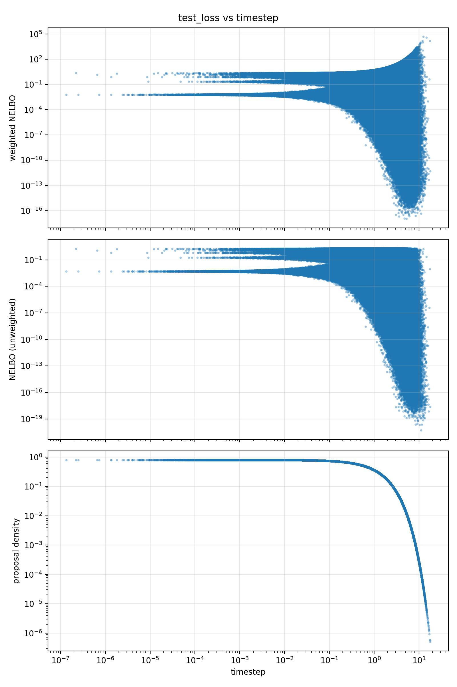

---

## $\lambda = 1.0$ — variance blow-up, mean still on target

**Poincaré: 0.4914, var 4,349**  ·  **Lorentz: 0.4914, var 4,349**

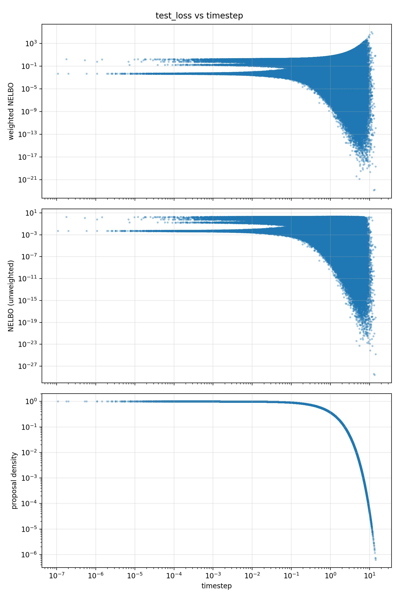 

---

## $\lambda = 2.0$ — biased low: tail under-sampled

**Poincaré: <r>0.3539</r>, var 1,349**  ·  **Lorentz: <r>0.3539</r>, var 1,349**

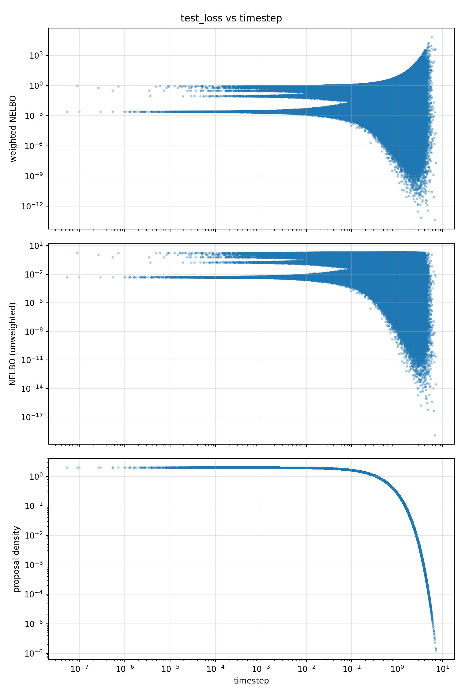 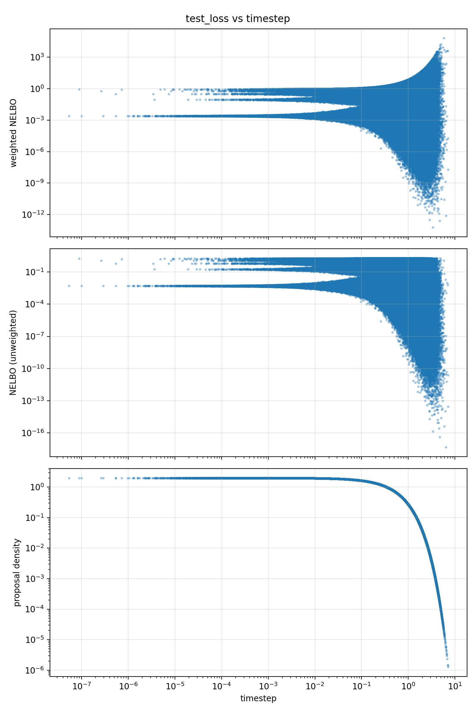

---

## Three Regimes — What Goes Wrong Where

| Regime | NELBO $\ell(t)$ | IS weight $w(t)$ | Outcome |
|---|---|---|---|
| **$\lambda \le 0.5$** (small) | Lorentz blows up in tail | moderate | <r>Lorentz NaN</r>, Poincaré OK |
| **0.1 – 0.3** | both bounded | $w(t)$ tame | <b>unbiased, low var</b> |
| **$\lambda \ge 0.8$** (large) | bounded | $w(t) = e^{\lambda t}/\lambda$ huge | high var, ~unbiased |
| **$\lambda \ge 2$** (too large) | bounded | $p(t) \approx 0$ past $t\approx 3$ | <r>biased low</r> (tail missed) |

---

## Conclusion

- Don't know why the visualized Lorentz per-sample estimate seem to have smaller variance than Poincare. They should be identical

---

# Various Ground-Truth Distributions

---

## Motivation

We re-run the optimal model (`mode=opt`, model output = ground truth) against **two new ground-truth unigrams** with very different entropies and inspect the test ELBO and CE across $\lambda$.

- **Low entropy** (`cmplx_ps`): concentrated on a few tokens
- **High entropy** (`cmplx_ps1`): near-uniform

Script: `unigram_test_script/unigram_test_lorentz_tmp3_cmplx_ps.sh`, `..._ps1.sh`.

---

## Experiment Set Up

- Script: `unigram/unigram_test2_tmp3.py`, **seed = 42**
- Model: **optimal** (`mode=opt`) — emits ground-truth unigram dist, no training
- Vocab size: **10**  |  bridge horizon: `hyper_T = 1000`, `hyper_dt = 0.01`, `rotate_emb = True`
- Test set: **4,000,000** samples per run
- Proposal: **stratified exponential**, $\lambda \in \{0.01, 0.1, 0.2, 0.3, 0.4, 0.5, 0.8, 1.0, 2.0\}$, plus uniform $[0.01, 10]$ baseline
- Geometries: **Lorentz–Cartesian**, **Poincaré–Polar**

---

## Experiment Set Up

Ground-truth data distribution

| Tag | Ground-truth $p$ | $H(p)$ |
|---|---|:--:|
| `cmplx_ps`  | $[0.31, 0.01, 0.20, 0.01, 0.01, 0.30, 0.08, 0.04, 0.03, 0.01]$ | **1.6664** |
| `cmplx_ps1` | $[0.11, 0.10, 0.10, 0.11, 0.11, 0.10, 0.10, 0.10, 0.09, 0.08]$ | **2.2985** |

---

## What "Good" Looks Like

For the optimal model the test ELBO equals the data entropy:

| Tag | target `test_loss` ( = `test_ce`) |
|---|:--:|
| `cmplx_ps`  (low entropy) | **1.6664** |
| `cmplx_ps1` (high entropy) | **2.2985** |

A good $\lambda$ is **(1)** NaN-free, **(2)** unbiased (mean $\approx$ target CE), **(3)** low-variance

---

## Low-Entropy (`cmplx_ps`, $H(p)$ = 1.6664)

---

### Low-Entropy — Poincaré–Polar

| $\lambda$ | IS-NELBO | IS-NELBO Var |
|:--:|:--:|:--:|
| unif $[0.01,10]$ | <r>1.5008</r> | 7.5 |
| 0.01 | <r>NaN</r> | <r>NaN</r> |
| **0.1**  | **1.6665** | **18.5** |
| 0.2  | 1.6672 | 43.1 |
| 0.4  | 1.6569 | 224.9 |
| 0.5  | 1.6682 | 1,258 |
| 0.8  | 1.8878 | 332,725 |
| 1.0  | 1.5875 | 4,490 |
| 2.0  | <r>1.3483</r> | 16,832 |

---

## Low-Entropy — Lorentz–Cartesian

| $\lambda$ | IS-NELBO | IS-NELBO Var |
|:--:|:--:|:--:|
| unif $[0.01,10]$ | <r>NaN</r> | <r>NaN</r> |
| 0.01 – 0.5 | <r>NaN</r> | <r>NaN</r> |
| 0.8  | 1.8878 | 332,725 |
| 1.0  | 1.5875 | 4,490 |
| 2.0  | <r>1.3483</r> | 16,832 |

---

## High-Entropy (`cmplx_ps1`, CE = 2.2985)

---

### High-Entropy — Poincaré–Polar

| $\lambda$ | IS-NELBO | IS-NELBO Var |
|:--:|:--:|:--:|
| unif $[0.01,10]$ | <r>2.0530</r> | 7.5 |
| 0.01 | <r>NaN</r> | <r>NaN</r> |
| **0.1**  | **2.2984** | **22.7** |
| 0.2  | 2.2950 | 42.8 |
| 0.4  | 2.2871 | 562.6 |
| 0.5  | 2.2872 | 1,996 |
| 0.8  | 2.6807 | 904,924 |
| 1.0  | 2.1632 | 5,135 |
| 2.0  | <r>1.8579</r> | 36,502 |

---

## High-Entropy — Lorentz–Cartesian

| $\lambda$ | IS-NELBO | IS-NELBO Var |
|:--:|:--:|:--:|
| unif $[0.01,10]$ | <r>NaN</r> | <r>NaN</r> |
| 0.01 – 0.5 | <r>NaN</r> | <r>NaN</r> |
| 0.8  | 2.6807 | 904,924 |
| 1.0  | 2.1632 | 5,135 |
| 2.0  | <r>1.8579</r> | 36,502 |

---

## Conclusion

- Best rate $\lambda = 0.1$ (Poincaré–Polar):

- The uniform-proposal **biased lower** by 0.17–0.25 (truncated at $t = 10$) across low to high entropy dataset.

---

# Next Steps

- Visualize the cross entropy loss across various timestep, see if the loss value is invariant across timesteps
- Try Unif with larger timestep range
- Set up trainable word embedding and compare with fixed word embedding
- Enlarge the vocab size and more complicated distribution
- Implement high-dim Hyperbolic heat kernel and posterior