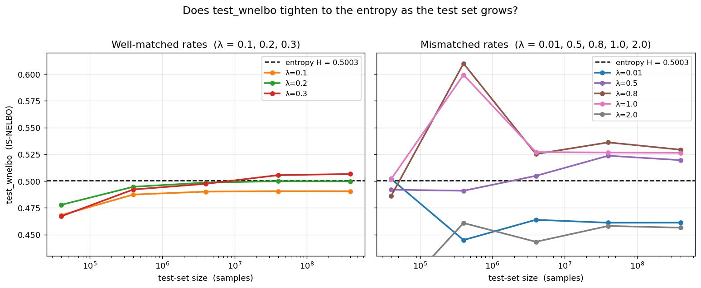
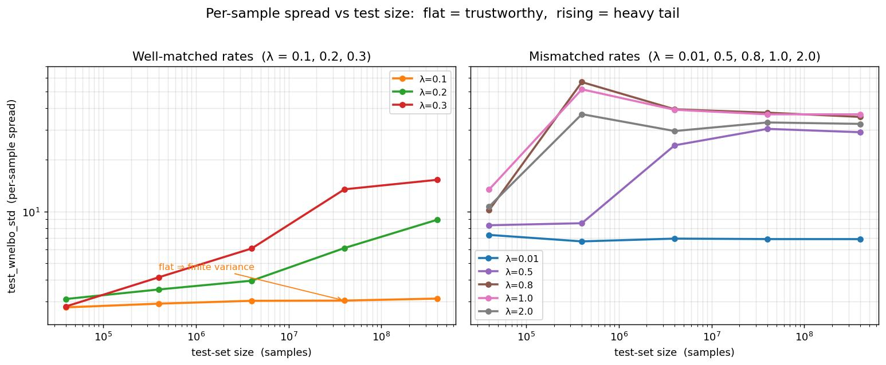
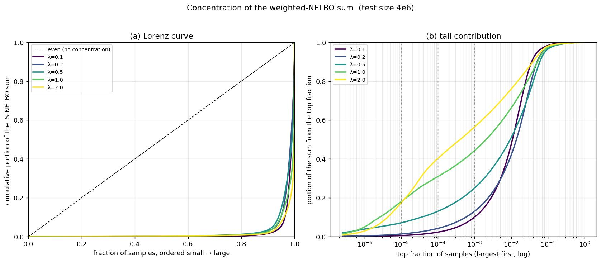
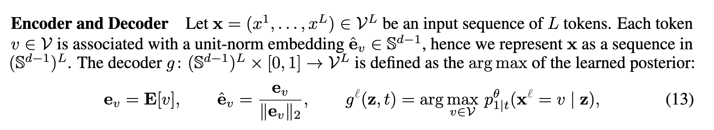
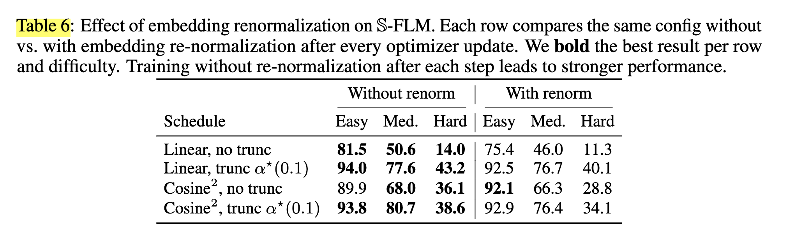
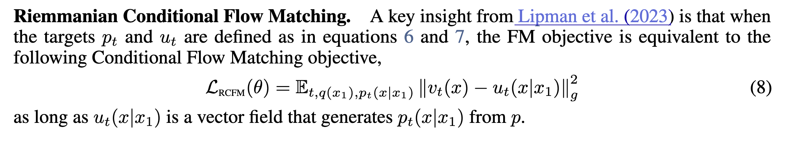
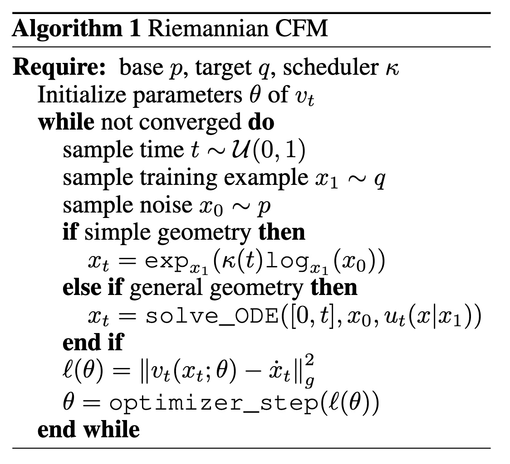

# Hyperbolic DLM

#### May 31, 2026

---

### Does a bigger test set tighten the ELBO to the entropy?

---

## The Question

> As the test set grows $4\times10^4 \to 4\times10^8$, does
> <b>`test_wnelbo`</b> converge to the data entropy?
> And does that convergence hold **across $\lambda$**?

For an **optimal model** the IS-NELBO is an *unbiased* estimator of the entropy — so in principle "more data ⇒ tighter." 

---

## Experiment Set Up

- Driver: `unigram/unigram_test2_tmp3.py` · script: `unigram_test_lorentz_tmp3.sh` · **seed = 42**
- Model: **optimal** (`mode=opt`) — emits the ground-truth unigram, no training
- Vocab 10 · Data dist $[0.91,\ 0.01\times 9]$ · entropy $H \approx$ **0.5003**
- Geometry: **Poincaré–Polar** · bridge horizon `hyper_T=1000`, `hyper_dt=0.01`
- Proposal: **plain exponential** $p(t)=\lambda e^{-\lambda t}$, rate $\lambda \in \{0.01,0.1,0.2,0.3,0.5,0.8,1.0,2.0\}$
- **test-set size:** $\{4\mathrm{e}4,\ 4\mathrm{e}5,\ 4\mathrm{e}6,\ 4\mathrm{e}7,\ 4\mathrm{e}8\}$

---

## Two Metrics, Two Roles

| Metric | Meaning | Role |
|---|---|---|
| `test_ce` | empirical cross-entropy of the optimal logits | **the target** $=H$ |
| `test_wnelbo` | importance-weighted Poincaré bridge ELBO | **the estimator** of $H$ |

<!-- ---

## `test_ce` is the Fixed Target — It Doesn't Move

`test_ce` $=$ <b>0.5003</b> for **every** $\lambda$ and **every** test size (drifts only $0.50029 \to 0.50031$ from 4e4 to 4e8 — pure sampling noise on the empirical entropy).

| metric | 4e4 | 4e5 | 4e6 | 4e7 | 4e8 |
|:--|:--:|:--:|:--:|:--:|:--:|
| `test_ce` (any $\lambda$) | 0.50029 | 0.50029 | 0.50029 | 0.50030 | 0.50031 |

It is independent of the timestep proposal — so it serves as the **ground-truth line** every `test_wnelbo` should approach. -->

---

## ELBO under various Testing Dataset Size

**More test data tightens to the entropy <r>only</r> when $\lambda$ is matched.**

---

## But the variance might also affect

Only $\lambda=0.1,0.01$ mainten flat std, but others **grow** with $N$.

---

## `test_wnelbo` Across Test Size and $\lambda$

| $\lambda$ | 4e4 | 4e5 | 4e6 | 4e7 | 4e8 |
|:--:|:--:|:--:|:--:|:--:|:--:|
| 0.01 | 0.5020 | 0.4449 | 0.4638 | 0.4611 | <r>0.4612</r> |
| **0.1**  | 0.4681 | 0.4874 | 0.4901 | 0.4905 | 0.4905 |
| **0.2**  | 0.4777 | 0.4946 | 0.4986 | **0.4999** | **0.4998** 
| **0.3**  | 0.4670 | 0.4921 | 0.4974 | 0.5055 | 0.5066 |
| 0.5  | 0.4919 | 0.4909 | 0.5049 | 0.5237 | 0.5195 |
| 0.8  | 0.4861 | 0.6099 | 0.5253 | 0.5361 | 0.5293 |
| 1.0  | 0.5018 | 0.5993 | 0.5271 | 0.5267 | 0.5264 |
| 2.0  | 0.3874 | 0.4608 | 0.4433 | 0.4581 | <r>0.4564</r> |

---

## The ELBO Estimation is Heavily Skew

Fraction of the **whole** weighted-NELBO sum coming from the very top samples (4M test set):

| $\lambda$ | top $10^{-5}$ | top $10^{-4}$ | top $10^{-3}$ | max weight |
|:--:|:--:|:--:|:--:|:--:|
| 0.1 | 0.5% | 2.3% | 10% | 713 |
| 0.2 | 1.3% | 4.2% | 13% | 2,836 |
| <r>1.0</r> | <r>**18%**</r> | <r>31%</r> | 44% | <r>28,261</r> |
| <r>2.0</r> | <r>**18%**</r> | <r>40%</r> | 57% | <r>14,294</r> |

At $\lambda{=}1.0$, **400 samples out of 4,000,000 (0.01%) carry ~31%** of the estimate

---

## The ELBO Estimation is Heavily Skew

---

## Three Regimes — Test-Size View

| Regime | $\lambda$ | More data does… | At 4e8 |
|---|:--:|---|:--:|
| **Too diffuse** | 0.01 | nothing — samples land past horizon $t{=}10$ | <r>0.461</r> |
| **Matched** | **0.1 – 0.3** | <b>tightens to $H$</b>, std flat/mild | **0.490 – 0.507** |
| **Heavy-tailed** | 0.5 – 1.0 | shrinks SEM, not the gap | 0.52 – 0.53 |
| **Tail-starved** | 2.0 | misses the tail entirely | <r>0.456</r> |

---

## Conclusion

- ELBO point estimate is heavily skew, few samples dominate the IS weighted average

---

# Learnable Word Embedding & Cross Entropy Loss

---

## Cross Entropy Loss

$$
\begin{aligned}
\mathcal{L}_{CE}(\theta)
 & =
\mathbb{E}_{z_{t} \sim q_{t \mid \infty}(\cdot \mid x), t \sim \text{Unif}([0, \infty]), y \sim q_{data}}
\left[
	- \sum_{i=1}^{L} \log p_{\infty | t}^{\theta}(x^{i} | z_{t})
\right] \\
& = \mathbb{E}_{z_{t} \sim q_{t \mid \infty}(\cdot \mid x), t \sim \text{Unif}([0, \infty]), y \sim q_{data}}
\left[ 
	- \sum_{i=1}^{L} \log \mu^{\theta, i}(z_t) 
\right]
\end{aligned}
$$

where the normalized embedding at $i$-th position is $x^{i} = \frac{e^{y^i}}{|| e^{y^i} ||_2}$ and the posterior $q_{t | \infty}(z | x)$, $y^i$ is the token index at position $i$.

---

## Two Model Parametrization

- Horocycle

$$
\mu^{\theta}(z_t) 
:= \operatorname{softmax}(f_{\theta}(z_t) + (d-1) \sum_{v \in V} e_v \langle v, z_t \rangle_{\mathbb{H}})
$$

where $\langle v, z_t \rangle_{\mathbb{H}}$ is the Busemann inner product

- Direct

$$
\mu^{\theta}(z_t) 
:= \operatorname{softmax}(f_{\theta}(z_t))
$$

---

## Learnable Embedding Normalization (Same as Hyperspherical FM)

---

## Experiments

2 Model Parametrization (Horocycle / Direct) 

$\times$ Learnable / Fixed Word Embedding

---

## Conclusion

---

# Hyperbolic Riemannian FLM

---

## Motivation

Hyperspherical FLM claims that they found normalizing the word embedding might cause worse performance.

---

## Idea

Hyperbolic space is a more natural way to model the word embedding with varying length.

Some old papers have shown that hyperbolic space can represent word embedding with very low dimension
- [POINCARE GLOVE: HYPERBOLIC WORD EMBEDDINGS](https://arxiv.org/pdf/1810.06546)

---

## Method

- [FLOW MATCHING ON GENERAL GEOMETRIES](https://arxiv.org/pdf/2302.03660) has shown that the OT path on a manifold is geodesic. 
- $q_{t|1}(z | x)$ can be computed by free hyperbolic heat kernel + geodesic moving
- Use Cross Entropy Loss instead of velocity regression

---

## Cross Entropy Loss

$$
\begin{aligned}
\mathcal{L}_{CE}(\theta)
 & =
\mathbb{E}_{z_{t} \sim q_{t \mid 1}(\cdot \mid x), t \sim \text{Unif}([0, 1]), y \sim q_{data}}
\left[
	- \sum_{i=1}^{L} \log p_{1 | t}^{\theta}(x^{i} | z_{t})
\right] \\
& = \mathbb{E}_{z_{t} \sim q_{t \mid 1}(\cdot \mid x), t \sim \text{Unif}([0, 1]), y \sim q_{data}}
\left[ 
	- \sum_{i=1}^{L} \log \mu^{\theta, i}(z_t) 
\right]
\end{aligned}
$$

where the word embedding at $i$-th position is $x^{i} = e^{y^i}$ and $y^i$ is the token index at position $i$. The model output $\mu^{\theta}$ can be represented as 

$$
\mu^{\theta}(z_t) 
:= \operatorname{softmax}(f_{\theta}(z_t))
$$

---

## Hyperbolic Geodesic

Lorentz model $\mathbb{H}^d=\{z:\langle z,z\rangle_L=-1\}$, with $\langle a,b\rangle_L=-a_0 b_0+\sum_{i\ge 1} a_i b_i$. Constant-speed geodesic from $x$ ($t{=}0$) to $y$ ($t{=}1$):

$$
\gamma(t)=\frac{\sinh\big((1-t)\,d\big)}{\sinh d}\,x+\frac{\sinh\big(t\,d\big)}{\sinh d}\,y,
\qquad d=\operatorname{arccosh}\!\big(-\langle x,y\rangle_L\big)
$$

---

## Hyperbolic Geodesic

- **It is SLERP with $\sin\!\to\!\sinh$, $\arccos\!\to\!\operatorname{arccosh}$** — same code, curvature flag $\kappa$: $\kappa{=}{+}1$ sphere ($\sin$), $\kappa{=}{-}1$ hyperboloid ($\sinh$). Stays on-manifold, $\langle\gamma(t),\gamma(t)\rangle_L=-1$.
- **Numerically stable distance** — compute $d$ from the *difference vector*, not $\langle x,y\rangle_L$ (which cancels to $\approx 1$ at large radius / high $d$):

$$
\cosh d-1=\tfrac12\,\langle x-y,\;x-y\rangle_L
\;\;\Rightarrow\;\;
d=\operatorname{arccosh}\!\Big(1+\tfrac12\langle x-y,x-y\rangle_L\Big)
$$

---

## FLOW MATCHING ON GENERAL GEOMETRIES

---

## FLOW MATCHING ON GENERAL GEOMETRIES

---

## High Dimensional Hyperbolic Free Heat Kernel

- High-Dimension Free Hyperbolic kernel sampling
  - [THE HEAT KERNEL ON ASYMPTOTICALLY HYPERBOLIC MANIFOLDS](https://arxiv.org/pdf/1612.06044)

---

## Some Potential Issue

sampling noisy data points by manifold linear interpolated method might be inaccurate if the source $x_0$ and target $x_1$ are far away.

$$
x_t = \exp_{x_1} (\kappa(t) \log_{x_1} (x_0))
$$

---

# Progress

- I've used Claude to implement the geodesic, free hyperbolic heat kernel sampler, and Poisson kernel. But I might need your help to double check.
- Still implementing
- Haven't derived the ELBO, but I think the performance on easy Sudoku is the most important test

---

### Trainable boundary points: CE survives, Poincaré ELBO diverges

---

## Set Up

- Driver `unigram/unigram_test2_tmp4.py` · `mode=tnb` (**trains** the denoiser) · seed 42 · 4M test
- **Learnable** embeddings: each word's boundary angle $=\operatorname{atan2}$ of its lm-head row
- Two train losses: <r>`cross_entropy`</r> and <b>`poincare_polar`</b> ELBO with uniform and exp proposal swept
- Target $=$ data entropy **0.5003** · CE `test_wnelbo` eval $=$ fixed PP stratified-exp(0.1)

---

## CE-Fixed Proposal Set Up

- CE `test_wnelbo` is evaluated by fixed proposal stratified-exp(0.1)

---

## CE-Fixed Proposal — Stable, but Stuck 

| proposal | `test_ce` | `ce_std` | `test_wnelbo` | `wnelbo_std` |
|:--|:--:|:--:|:--:|:--:|
| unif   | <b>0.356</b> | 1.17 | <b>0.570</b> | 3.74 |
| exp 0.1 | 1.959 | 0.18 | 2.215 | 5.56 |
| exp 0.2 | 1.968 | 0.21 | 2.227 | 5.58 |
| exp 0.3 | 1.977 | 0.23 | 2.219 | 5.58 |
| exp 0.5 | 1.984 | 0.24 | 2.195 | 5.56 |
| exp 0.8 | 1.986 | 0.24 | 2.167 | 5.54 |
| exp 1.0 | 1.987 | 0.24 | 2.154 | 5.53 |

---

## PP-Fixed Proposal Set Up

- PP (Poincare Polar) `test_wnelbo` is evaluated by identical proposal as loss

---

## PP-trained — Diverges to NaN

| proposal | `test_ce` | `ce_std` | `test_wnelbo` | `wnelbo_std` |
|:--|:--:|:--:|:--:|:--:|
| exp | <r>NaN</r> | <r>NaN</r> | <r>NaN</r> | <r>NaN</r> |

`train_loss`: **2.07 → NaN at step 2.** Every Poincaré-ELBO run blows up almost immediately

---

## Insight — The Embedding Was the Wrong Knob

| train loss | fixed emb | learnable emb |
|:--|:--:|:--:|
| <b>Poincaré ELBO</b> | **best**, `wnelbo` ≈ 0.40 | <r>NaN — step 2</r> |
| <r>Cross-entropy</r> | ~2.0 | ~2.0 |

- **Trainable boundary points destabilize the ELBO**: its $1/\lVert y-z_t\rVert^2$ and $(1-\lVert z\rVert^2)^2$ terms blow up once $y$ can drift toward $z_t$.
- **CE is robust but uninformative** — learnable vs fixed barely moves `test_ce`; still ~4× the entropy.
- Net: learnability **broke the one loss that worked** (fixed-emb PP) and didn't help CE → needs boundary regularization / grad-clip / lower lr before ELBO training is viable.

